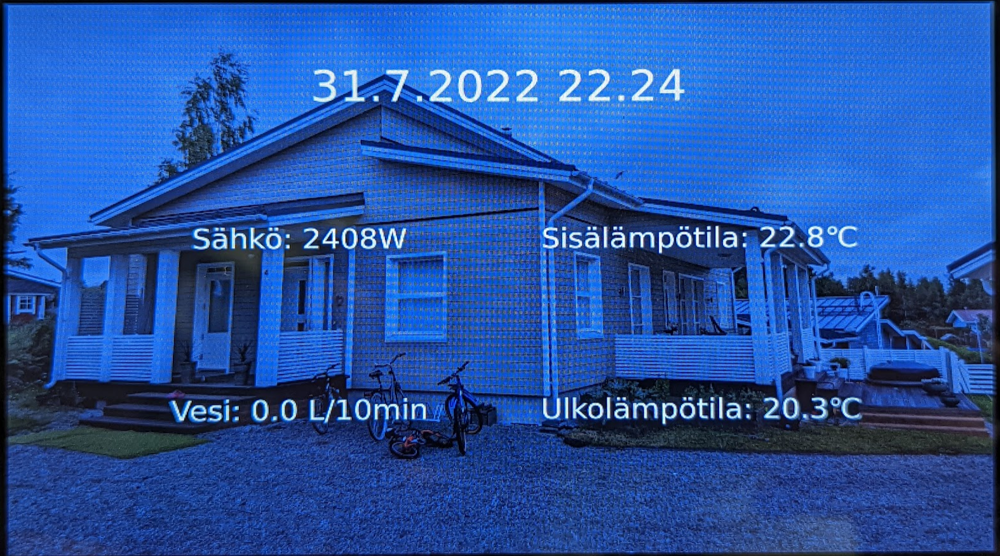
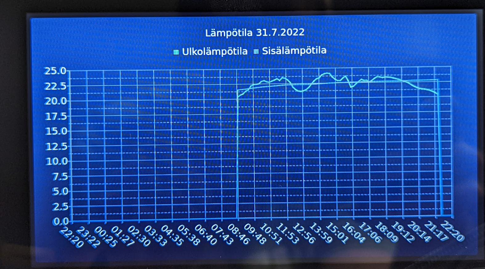
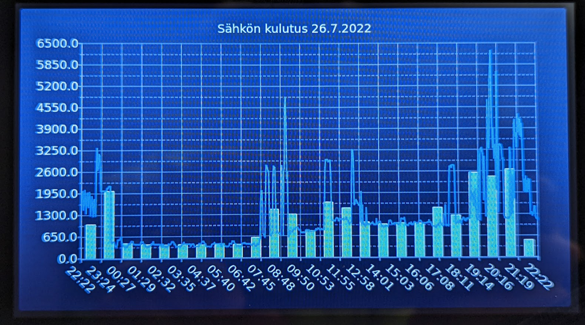
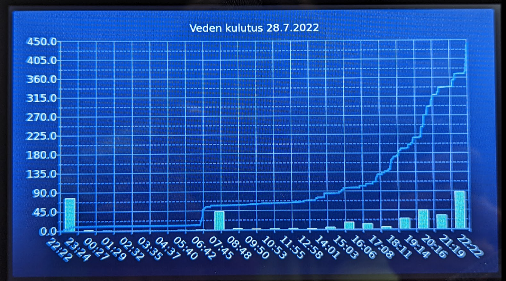

# Rpi Dashboard

Rpi Dashboard is a dashboard application meant to be run with a Rapsberry Pi with 7" touch screen.
The dashboard shows temperature, water consumption and power consumption data. The main screen
shows date, time, current power consumption, water consumption in the last 10 minutes and indoor/
outdoor temperature. If any of the current value is touched, the view will change in to a graph
view that shows the history data from the last 24 hours. Touching the sides of the screen will
change the showed time by 24 hours backwards or forwards. Touching the center of the screen will
return to the main view.

### Some pictures

